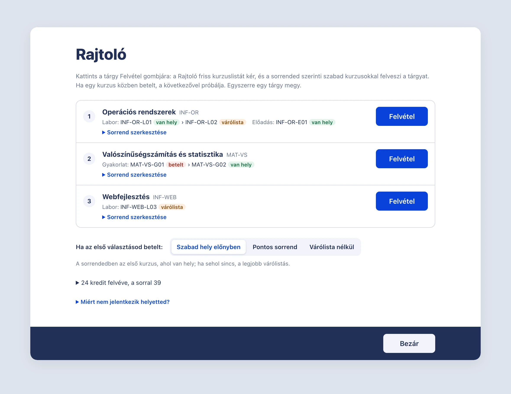
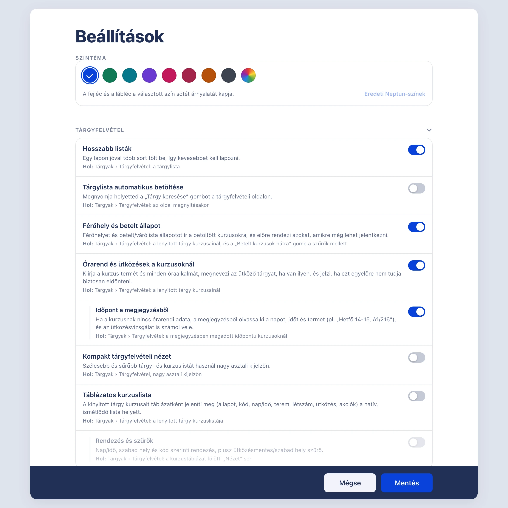
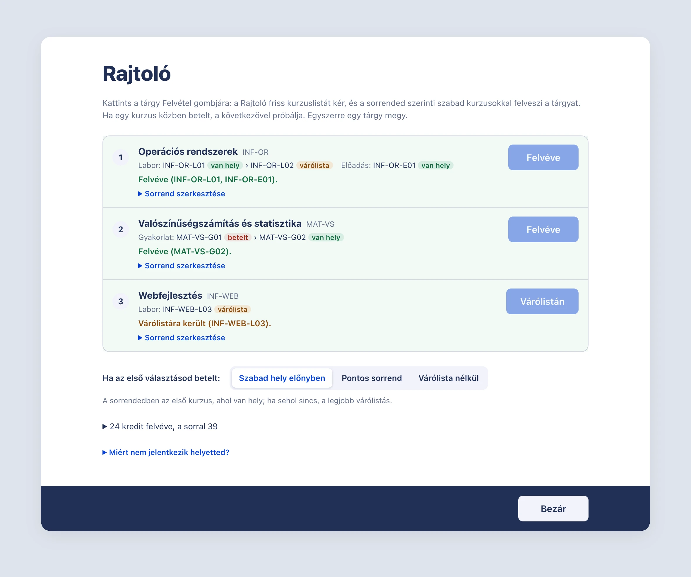

<picture>
  <source media="(prefers-color-scheme: dark)" srcset="docs/assets/npu-logo-dark.svg">
  
</picture>

# Neptun PowerUp!

**Gyorsabb, átláthatóbb és kiszámíthatóbb Neptun — az új, Angular-alapú felülethez.**

[**Telepítés**](#telepítés) · [Funkciók](#funkciók) · [Rajtoló](#a-rajtoló) · [Adatvédelem](#adatvédelem) · [Hibaelhárítás](#hibaelhárítás) · [Közösség](https://github.com/varannaibence/npu-uj-neptunhoz/discussions)

_Az egyetem már így is elég nehéz. Ne a Neptun tegye nehezebbé._

---

Mi is Neptunon veszünk fel tárgyakat. Ismerjük a nyitás előtti frissítgetést,
a betelt kurzust, amiről csak a harmadik kattintás után derül ki, hogy betelt,
és az órarendet, ami papíron jó volt, aztán mégis ütközött. A **Neptun
PowerUp!** (NPU) ezért készült.

Az NPU egy userscript, vagyis egy kis program a böngésződben, ami a Neptun
hallgatói felületét egészíti ki. Kiírja a kurzusok férőhelyét és az órarendi
ütközéseket, mentett kurzussorrenddel segíti a kézi tárgyfelvételt, és a felületet a saját
ízlésedre színezheted. Minden helyben, a böngésződben fut: nincs saját
szerverünk, nem kell fiók, és a jelszavadat nem tároljuk.

A 3.x sorozatot az **új Neptun NG felülethez** írtuk, a nulláról. A régi
felülethez tartozó 2.4.1-es kiadás az [eredeti
projektben](https://github.com/solymosi/npu) érhető el, de az új Neptunon nem
működik.

> **Korai fejlesztési fázis.** A működés és a felület még változhat. Hogy melyik
> intézményen mit ellenőriztünk, azt a [docs/TESTED.md](docs/TESTED.md) mutatja.

  
   A Rajtoló ablaka, példaadatokkal.

## Amiért csináljuk

Nem az egyetem vagy a Neptun ellen dolgozunk. Azt szeretnénk, hogy a
tárgyfelvétel és a félév kevesebb stresszel járjon: lásd előre, hol van hely és
mi ütközik, tudj nyugodtan órarendet tervezni, és ne kelljen ugyanazt tízszer
kikattintanod. Minden más funkció is ezt szolgálja, a „Mi van ma?” kártyáktól a
színezésig.

Ezért van, amit akkor sem építünk be, ha technikailag menne:

- nem küldünk kérést helyetted, időzítve vagy a háttérben;
- nem terheljük a Neptun szerverét jobban, mint amikor kézzel kattintasz;
- nem kerüljük meg a belépést, a kétlépcsős azonosítást vagy a CAPTCHA-t.

Ha egy ötlet ezek közül bármelyikbe ütközik, nem kerül be, akármilyen kényelmes
lenne. Részletek: [Felelősség és használat](docs/FELELOSSEG.md).

## Funkciók

Minden funkció (a lábléc kivételével, mert azon át nyílik a panel) egyenként
kapcsolható a **Neptun PowerUp! beállítások**
panelben (a lap alján, **NPU beállítások**); a módosítás a következő
oldalbetöltéskor lép életbe. A panel minden funkciónál kiírja, hol találod a
Neptunban; ugyanez áll az alábbi táblázatok **Hol található** oszlopában.

Az NPU által az oldalra tett gombokon és kapcsolókon az NPU kék ikonja látszik,
fölé húzva pedig az „NPU-funkció” felirat. Ami nem ilyen, az a Neptun saját része.

  
   A beállítások panel, példaadatokkal.

A **Ki** alapállapot szándékos döntés, nem félkész funkciót jelez. Ezek a
modulok a Neptun megszokott elrendezését vagy munkafolyamatát változtatják meg,
vagy a háttérben maguktól indítanak kérést, ezért csak kifejezett bekapcsolás
után lépnek működésbe. Saját kérést néhány alapból bekapcsolt funkció is küld
(például a „Mi van ma?” a kezdőlapon, az Átlagkalkulátor és a Javaslatok
megnyitáskor); hogy pontosan mit, azt a [fejlesztői
leírás](docs/DEVELOPMENT.md) sorolja fel.

### Tárgyfelvétel

| Funkció | Leírás | Hol található | Alapállapot |
| --- | --- | --- | :---: |
| Férőhely és várólista | Kurzusonként jelzi a szabad helyet, a beteltséget és a várólistát; tárgyanként a betelt kurzusok számát. | Tárgyak › Tárgyfelvétel: a lenyitott tárgy kurzusai | Be |
| Órarendi ütközések | Megnevezi az ütköző tárgyat és időpontot a tervezőben lévő és a már felvett kurzusok alapján. | Tárgyak › Tárgyfelvétel: a lenyitott tárgy kurzusai | Be |
| ↳ Időpont a megjegyzésből | Ha a Neptun nem ad órarendi adatot, a kurzus megjegyzéséből olvassa ki a napot, az időt és a termet (pl. „Hétfő 14-15, A1/216”), és az ütközésvizsgálatban is felhasználja. | Tárgyak › Tárgyfelvétel: a lenyitott tárgy kurzusai | Be |
| Gyorsabb kurzuslista | Egy oldalon lényegesen több sort tölt be, így kevesebbet kell lapozni. | Tárgyak › Tárgyfelvétel: a tárgylista | Be |
| Betelt kurzusok hátra | A még felvehető kurzusokat előre rendezi a lenyitott listában. | Tárgyak › Tárgyfelvétel: gomb a szűrők mellett | Gombbal |
| Tárgylista automatikus betöltése | Külön keresés nélkül elindítja a tárgyak listázását. | Tárgyak › Tárgyfelvétel: az oldal megnyitásakor | Ki |
| Táblázatos kurzuslista | Szűrhető, rendezhető táblázatra cseréli a natív kurzuslistát: állapot a kód mellett, nap-chip és terem, telítettségi sáv, az ütköző tárgy neve, színkódolt sorok. | Tárgyak › Tárgyfelvétel: a lenyitott tárgy | Ki |
| Kompakt nézet | Sűrűbb elrendezés nagy asztali kijelzőkhöz. | Tárgyak › Tárgyfelvétel, nagy kijelzőn | Ki |

### Rajtoló

| Funkció | Leírás | Hol található | Alapállapot |
| --- | --- | --- | :---: |
| Sorba rendezett tárgyfelvétel | Mentett kurzussorrend tartalékkurzusokkal. Az ablakában egy kattintás egy tárgy: friss kurzuslista, és felvétel a sorrended szerinti szabad kurzusokkal; ha egy kurzus közben betelt, a következővel próbálja. Magától semmit nem küld el. [Részletek](#a-rajtoló) | Tárgyak › Tárgyfelvétel: **Rajtoló** gomb a szűrők mellett, **Rajtolóhoz** kapcsoló a kurzusoknál | Be |
| ↳ Órarendjavaslatok | **Javaslatok** gomb a Neptun Órarendtervezőjében: a felvett órák mellé ütközésmentes kurzusválasztást keres (kevesebb lyukas óra, több szabad nap vagy legkevesebb csere), a heti rácson előnézetben mutatja; megerősítés után a Neptun Tervezőjében is a javasolt kurzusokra cseréli a tervezetteket, és átrendezi a Rajtoló sorrendjét. | Tárgyak › Tárgyfelvétel: a lap alján nyíló Órarendtervező fejléce | Be |

### Mindennapok

| Funkció | Leírás | Hol található | Alapállapot |
| --- | --- | --- | :---: |
| Mi van ma? | A kezdőlap tetején, a Neptun kártyáival egyező három kártyán a mai órák teremmel, a befizetési határidők és a futó vagy közelgő tárgyfelvételi időszakok. Ha egy határidő vagy időszak 3 napon belül esedékes, naponta egyszer értesít. | Kezdőlap, a tetején | Be |
| ↳ Befizetendő tételek | Kártya a befizetendő tételekkel, összeggel és határidővel. | Kezdőlap | Be |
| ↳ Időszakok | Kártya a futó és 45 napon belül nyíló tárgy- és vizsgajelentkezési időszakokkal. | Kezdőlap | Be |
| ↳ Napi értesítés | Bejelentkezés után naponta egyszer jelez, ha egy befizetés vagy időszak 3 napon belül esedékes, vagy egy befizetés lejárt. | Bejelentkezés után, felugró értesítés | Be |
| Átlagkalkulátor | A Felvett tárgyak oldalon a várt jegyekből kiszámolja a félév súlyozott átlagát, kreditindexét és korrigált kreditindexét. Csak akkor mutat eredményt, ha egy lezárt félév újraszámolása egyezik a Neptun saját értékeivel. | Tárgyak › Felvett tárgyak: gomb a szűrő mellett | Be |

### Megjelenés és kényelem

| Funkció | Leírás | Hol található | Alapállapot |
| --- | --- | --- | :---: |
| Színtéma | A Neptun kékje helyett választható kiemelőszín (8 minta vagy egyéni); a fejléc és a lábléc ennek sötét árnyalatát kapja. | NPU beállítások (lábléc) | Neptun kék |
| Kreditbontás | A fejlécben tárgytípusonként bontja a ténylegesen felvett krediteket. | Tárgyak › Tárgyfelvétel: a fejléc kreditkártyája | Be |
| Visszatérés az előző oldalra | Bejelentkezés után felajánlja a legutóbb használt oldal megnyitását. | Bejelentkezés után, felugró értesítés | Be |
| Munkamenet életben tartása | A tárgyfelvételi oldalon tétlen fülnél is megakadályozza a kiléptetést: mielőtt a munkamenet lejárna (12,5 perc tétlenség, vagy 10 perce nem frissült token után), megnyomja a Neptun saját keresőgombját. | Tárgyak › Tárgyfelvétel, a háttérben | Ki |
| Verzió és hibabejelentés | Az NPU neve és verziója a bejelentkező oldalon és a láblécben, hibabejelentő linkkel. | Bejelentkező oldal és lábléc | Be |
| Frissítés jelzése | Amikor a Tampermonkey frissíti az NPU-t, a következő betöltéskor egyszer jelzi az új verziót, a változásnapló linkjével. | Frissítés utáni első betöltéskor | Be |

### Fejlesztői eszközök

| Funkció | Leírás | Hol található | Alapállapot |
| --- | --- | --- | :---: |
| Fejlesztői mód | Napló arról, mit lát és mit tesz az NPU: API-hívások metódussal, státusszal és időtartammal, munkamenet-váltások, útvonalak, szerveróra-eltérés, a Rajtoló lépései és az egyébként elnyelt hibák, plusz egy állapotlap (token lejárta, szerveróra, bekapcsolt modulok). Csak memóriában tartja, maszkolva; egy gombbal beküldhető: a vágólapra másolja, és megnyitja a GitHub „Mérés” űrlapját. | Tampermonkey menü › **NPU fejlesztői eszközök** | Ki |
| ↳ Mérőmód | Maszkolva elmenti a Neptun még nem mért tárgyfelvételi válaszait (pl. sikeres jelentkezés, betelt kurzus elutasítása), hogy elküldhesd a fejlesztőknek. [Hogyan?](docs/TESTED.md#mérőmód-minta-a-még-nem-mért-válaszokról) | Tárgyak › Tárgyfelvétel, a háttérben | Be |

## Telepítés

Az NPU a **Tampermonkey** böngészőbővítménnyel fut. A telepítés néhány perc.

**1. Tampermonkey telepítése** —
[Chrome](https://chromewebstore.google.com/detail/tampermonkey/dhdgffkkebhmkfjojejmpbldmpobfkfo) ·
[Firefox](https://addons.mozilla.org/firefox/addon/tampermonkey/) ·
[Edge](https://microsoftedge.microsoft.com/addons/detail/tampermonkey/iikmkjmpaadaobahmlepeloendndfphd) ·
[Opera](https://addons.opera.com/en/extensions/details/tampermonkey-beta/) ·
[Safari](https://apps.apple.com/app/tampermonkey/id1482490089)

**2. Userscriptek engedélyezése (csak Chrome és Edge)** — az újabb verziók ezt
külön kérhetik; enélkül az NPU látszik a Tampermonkey menüjében, de a Neptunon
nem fut.

Lépések Chrome és Edge alatt

1. Nyisd meg a `chrome://extensions` (Edge: `edge://extensions`) oldalt.
2. A Tampermonkeynál kattints a **Részletek** gombra.
3. Kapcsold be a **Felhasználói szkriptek engedélyezése** / **Allow User
   Scripts** lehetőséget.
4. Ellenőrizd, hogy a Tampermonkey hozzáférhet a Neptun webhelyéhez.

Ha Edge alatt nem látsz ilyen kapcsolót, nincs vele teendőd. Firefox és Safari
alatt ez a lépés kimarad.

**3. Az NPU telepítése** —
[**Neptun PowerUp! telepítése**](https://github.com/varannaibence/npu-uj-neptunhoz/releases/latest/download/npu.user.js),
majd a Tampermonkey ablakában **Telepítés** / **Install**. Ha a böngésző csak
letölti az `npu.user.js` fájlt, nyisd meg, és engedd a Tampermonkeynak
telepíteni.

**4. Neptun megnyitása** — az NPU 3 csak az új felületen működik, amelynek
címében szerepel a `/hallgato_ng/` rész. Nyisd meg, és töltsd újra egyszer.

**5. Ellenőrzés** — a telepítés akkor sikeres, ha a Neptun oldalán:

- a Tampermonkey ikonján megjelenik az `1`-es jelzés,
- a menüben látszik a **Neptun PowerUp! beállítások** pont,
- a bejelentkező oldalon vagy a lap alján olvasható a **Neptun PowerUp!
  v3.x.x** felirat.

> **Fejlesztőknek:** fejlesztéshez ne a release-t telepítsd: a helyi loader, a build, a tesztek és
> a kiadási folyamat a [fejlesztői útmutatóban](docs/DEVELOPMENT.md) található.

<!-- releases:start -->
## Legfrissebb kiadások

A legutóbbi három stabil kiadás. A **Telepítés** link Tampermonkey mellett
közvetlenül telepíthető.

<strong>v3.3.0</strong> · 2026. szept. 30.

**Rajtoló**

- Új, gyors, kattintásos felvétel: a Rajtoló ablakában tárgyanként egy
  **Felvétel** gomb van. Egy kattintásra friss kurzuslistát kér, a sorrended
  szerinti szabad kurzusokkal felveszi a tárgyat, és kiírja a Neptun válaszát.
  Utána a következő tárgy gombja kap fókuszt.
- Ha a beküldött kurzus közben betelt, ugyanazon a kattintáson belül a
  következővel próbálja, legfeljebb négyszer, és ugyanazt a kurzust soha nem
  küldi el kétszer. Hogy betelt-e, azt a friss kurzuslistából dönti el, nem az
  üzenet szövegéből.
- A Rajtoló többé nem küld magától tárgyfelvételt: megszűnt az időzített
  indítás, a nyitás körüli újraküldés, a betelt tárgyak figyelése, a
  munkamenet életben tartása és a nyitási emlékeztető. Egy kattintás egy tárgy,
  egyszerre egy. Utánanéztünk: az ilyen scriptek terhelik a szervert, és volt
  már miattuk fegyelmi eljárás, ezért így a legbiztonságosabb.
- Letisztult ablak: a tárgyak sorrendje és a **Felvétel** gombok, a sorrend
  szerkesztése tárgyanként lenyitható, a kurzuskódok és időpontok saját kérés
  nélkül látszanak. A **Kurzusválasztás**, az ütközésjelzés és a
  kredit-előrejelzés megmaradt.

**Egyéb**

- Új [Felelősség és használat](docs/FELELOSSEG.md) lap: mit vállalunk, mire
  figyelj, és miért nézd meg az intézményed Neptun-szabályzatát.
- Új, alapból kikapcsolt **Fejlesztői mód** („Fejlesztői eszközök” csoport):
  napló az API-hívásokról (metódus, státusz, időtartam, időtúllépés), a
  munkamenet-váltásokról, az útvonalakról, a szerveróra-eltérésről, a Rajtoló
  lépéseiről és az eddig csendben elnyelt hibákról, szerveridővel; állapotlap a
  token lejártáról és a bekapcsolt modulokról. A Tampermonkey menüjéből
  („NPU fejlesztői eszközök”) nyílik. A **Beküldés GitHubon** gomb a vágólapra
  másolja, és megnyitja a GitHub „Mérés” űrlapját, ahová csak be kell illeszteni.
  Csak memóriában él, maszkolva, és magától semmit nem küld el.
- A Fejlesztői mód része a **Mérőmód**: maszkolva elmenti a Neptun még nem mért
  tárgyfelvételi válaszait (sikeres jelentkezés, betelt kurzus elutasítása,
  leadás, kurzuscsere), kézi és Rajtolós felvételnél egyaránt.
- Ha egy modul indításkor hibára fut, a többi modul ettől még elindul.

[Release megnyitása](https://github.com/varannaibence/npu-uj-neptunhoz/releases/tag/v3.3.0) · [Telepítés](https://github.com/varannaibence/npu-uj-neptunhoz/releases/download/v3.3.0/npu.user.js)

[Összes kiadás megtekintése](https://github.com/varannaibence/npu-uj-neptunhoz/releases)
<!-- releases:end -->

## A Rajtoló

A Rajtolóban előre összeállítod, melyik kurzusra mennél, és ha az betelt,
melyik jöhet helyette. Nyitáskor a Rajtoló ablakában csak végigkattintasz a
tárgyaidon: minden kattintás egy tárgyat vesz fel. Ez gyorsabb a kézi
felvételnél, mert nem kell tárgyanként keresgélned, lenyitnod és pipálnod.

1. A **Tárgyfelvétel** oldalon a kívánt kurzusoknál kapcsold be a
   **Rajtolóhoz** kapcsolót. Egy kurzustípuson belül (például a laborok
   között) a bekapcsolás sorrendje a rangsor.
2. Nyisd meg a Rajtolót a szűrők mellett. A tárgyak abban a sorrendben állnak,
   ahogy kattintani fogod őket; tárgyanként a **Sorrend szerkesztése** alatt
   átrendezheted őket és a kurzusokat. Alul eldöntheted, mi legyen, ha az első
   választásod betelt: szabad hely előnyben, pontos sorrend, vagy várólista
   nélkül.
3. Nyitáskor kattints a tárgy **Felvétel** gombjára. A Rajtoló friss
   kurzuslistát kér, kurzustípusonként a sorrendedben első szabad kurzussal
   felveszi a tárgyat, és kiírja a Neptun válaszát. Utána a következő tárgy
   gombja kap fókuszt, így Enterrel is mehetsz tovább.

  
   Végigkattintás után, példaadatokkal.

Ha a beküldött kurzus közben betelt, ugyanazon a kattintáson belül a
sorrendedben következővel próbálja, kattintásonként legfeljebb négyszer, és
ugyanazt a kurzust soha nem küldi el kétszer. Minden más elutasításnál (például
nincs nyitva a tárgyfelvétel, vagy nem teljesül egy előfeltétel) megáll, és
kiírja a Neptun üzenetét. Ha a szerver nem válaszol időben, nem küldi újra,
mert a kérés attól még célba érhetett: egyszer megnézi, felvett-e, és ezt írja
ki. Egyszerre egy tárgy megy. Ha a tárgyból már van felvett vagy várólistás
kurzusod, semmit nem küld.

A felvételt a Rajtoló ugyanazzal a két kéréssel végzi, amit a Neptun is küld,
ha kézzel veszed fel a tárgyat. A Neptun tárgylistája az eredményt a **Tárgy
keresése** után mutatja. Ha a belépési token közben lejárt, a Rajtoló előbb a
Neptun saját **Tárgy keresése** gombjával frissíttet, ettől a lista is
újratöltődik.

> A Rajtolót még nem próbáltuk ki éles tárgyfelvételen. Az eredményt mindig
> nézd meg a Neptunban is.

<strong>Miért nem jelentkezik helyetted magától?</strong>

Utánanéztünk: az időzítve vagy újra és újra beküldő scriptek terhelik a Neptun
szerverét, előnyt adnak a többiekkel szemben, és volt már rá példa, hogy egyetem
fegyelmi eljárást indított miattuk. Ezért a Rajtoló csak azt teszi, amit te is
megtennél, csak gyorsabban: egy kattintásra egy tárgyat vesz fel, ugyanazokkal a
kérésekkel, amiket a Neptun is küld. Nincs időzítés, ismételgetés vagy háttérben
figyelés, így a szervert sem terheli jobban, mint a kézi felvétel. Reméljük, így
senki nem kerül bajba.

Az intézményed szabályzata ettől még tilthatja az ilyen kiegészítőket: nézd meg,
mielőtt használod. Részletek: [Felelősség és használat](docs/FELELOSSEG.md).

A terv felhasználónként és félévenként a böngésződben tárolódik, a kurzusok
kódjával és időpontjával együtt. A Neptun **Tervezőhöz adás** kapcsolója ettől
független funkció.

Az Órarendtervező **Javaslatok** gombja a Rajtolóban és a Neptun Tervezőjében
kiválasztott kurzuscsoportokhoz keres ütközésmentes kombinációt a már felvett
órák mellé. Három változatot kínál: kevesebb lyukas óra, több szabad nap, vagy
a lehető legkevesebb csere. A kiválasztott változat szaggatott keretes
kártyákként jelenik meg a heti rácson; ha a terved már a legjobb, ezt mondja
ki, és nem ajánl módosítást. Az **Alkalmazás** előbb felsorolja, mi változik:
a Neptun Tervezőjében lévő kurzusokat a javasoltakra cseréli (a szerveren, a
Neptun saját kéréseivel), a Rajtoló sorrendjét pedig átrendezi. Ha egy lépést
a Neptun elutasít, az addigiakat visszagörgeti; a panelen visszavonható. A
rács a frissült Tervezőt az oldal újratöltése után mutatja. Ha egy már felvett kurzus típusából (például laborból) egy másikat
teszel a Tervezőbe, azt cserének veszi, és megmutatja, megéri-e cserélni; a
cserét magát a Neptunban végezheted el. „Nincs ismert ütközés” azt jelenti, hogy
az ismert időpontok között nincs átfedés: az időpont nélküli kurzusokra külön
figyelmeztet.

> A Rajtoló nem jelentkezik be helyetted, nem tárol jelszót és nem kezel
> kétlépcsős kódot.

## Fontos korlátok

- **Intézményi lefedettség.** Az ellenőrzött állapot a
  [docs/TESTED.md](docs/TESTED.md) lapon látható; ami nincs benne, arról nincs
  mérésünk.
- **A döntést a Neptun hozza.** Hogy a felvétel sikerült-e, azt a Neptun
  válasza mondja meg. A sikeres felvétel és a betelt kurzus elutasításának
  pontos válaszát még nem mértük éles tárgyfelvételi időszakban; a Rajtoló ezért
  a betelt állapotot a friss kurzuslistából dönti el, nem az üzenet szövegéből.
- **Tétlen munkamenet.** A magára hagyott fül munkamenete lejárhat.
  A Rajtoló nem tartja életben. A külön bekapcsolható
  **Munkamenet életben tartása** funkció a tárgyfelvételi oldalon a Neptun
  saját keresőgombját használja.
- **Ütközésjelzés.** Csak azokkal a kurzusokkal számol, amelyekhez a Neptun
  felismerhető azonosítót, és órarendi adatot vagy értelmezhető megjegyzést ad.
  Hiányzó időpontnál ezt jelzi, és nem állítja, hogy nincs ütközés.
- A régi, 2.4.1-es kiadás funkciólistája nem a v3 képességeit írja le.

## Adatvédelem

Az NPU a böngésződben fut, és semmit nem küld saját szerverre: ilyen
szerverünk nincs is. A Rajtoló tervei, a beállítások és a legutóbb látott NPU-verzió helyben maradnak,
jelszót a v3 nem tárol. A bekapcsolt Fejlesztői mód naplója csak a memóriában
él, a Mérőmód mintái helyben maradnak; mindkettő maszkolt, és csak az kerül ki
belőlük, amit te másolsz ki és küldesz el.

Mi történik a régi (2.x) adatokkal?

- A régi `neptun.users` GM-kulcsot (a korábbi bejelentkezési mentést) a v3 nem
  olvassa, nem importálja és nem törli.
- A v3 saját `data.users` adataiban maradt bejelentkezési és hitelesítési
  mezőket induláskor kitisztítja; a terveket és az egyéb nem érzékeny adatokat
  meghagyja.
- A régi `neptun.courses` értékéből csak biztonságos kulcsú, nem érzékeny
  kurzusválasztás kerülhet a `courses._legacy` részbe. A régi GM-forrásokat a
  program nem törli.

A jelszavadat mindig a Neptun saját oldalán add meg — sem a programnak, sem egy
hibabejelentésnek ne küldd el.

## Hibaelhárítás

<strong>A script ott van a Tampermonkeyben, de az oldalon semmi nem változik</strong>

Nézd meg, van-e `1`-es jelzés a Tampermonkey ikonján. Ha nincs, a script
telepítve van, de nem fut: Chrome és Edge alatt ellenőrizd a userscript-engedélyt
és a Neptun webhelyéhez adott hozzáférést ([2. lépés](#telepítés)).

<strong>Van <code>1</code>-es jelzés, de nincs NPU-felirat vagy beállítási menü</strong>

Töltsd újra az oldalt. Ha továbbra sem jelenik meg, valószínűleg indulási hiba
történt: nyiss hibajegyet, és csatold a böngésző fejlesztői konzoljában
megjelenő első piros NPU-hibát.

<strong>Az NPU fut, de valamelyik funkció hiányzik</strong>

Ez lehet intézményi eltérés. Nézd meg az [ellenőrzött intézmények
listáját](docs/TESTED.md), majd írd meg, pontosan melyik funkció nem működik.

<strong>A Rajtoló nem veszi fel a tárgyat</strong>

A tárgy alatt álló szöveg megmondja, miért nem:

- **Nincs szabad kurzus a sorrendedben:** minden bekapcsolt kurzusod betelt.
  Válassz kézzel a Neptunban, vagy kapcsolj be másik kurzust a Rajtolóhoz.
- **A Neptun nem vette fel:** a Neptun saját üzenete áll utána, például hogy
  még nincs nyitva a tárgyfelvétel, vagy nem teljesül egy előfeltétel.
- **Bizonytalan:** a szerver nem válaszolt időben. Nézd meg a Neptunban, mielőtt
  újra kattintasz.

Ha nem jutsz dűlőre, írj nekünk a [GitHub issue
trackerben](https://github.com/varannaibence/npu-uj-neptunhoz/issues). Sokat
segít, ha megírod a verziót (a lap alján olvasható), az intézményedet, az oldalt,
és hogy mit csináltál, mielőtt elromlott. Képernyőkép jöhet, de jelszót, sütit,
belépési tokent vagy teljes hálózati exportot ne csatolj.

## Közösség és közreműködés

Az NPU attól lesz jobb, hogy minél több egyetemen kipróbálják. Ha a tiéden
működik (vagy épp nem), azt is szívesen halljuk.

- Kérdés, ötlet, intézményi tapasztalat: [GitHub
  Discussions](https://github.com/varannaibence/npu-uj-neptunhoz/discussions).
- Saját funkciót modulként, pull requestben küldhetsz; a módját a
  [docs/CONTRIBUTING.md](docs/CONTRIBUTING.md) írja le.
- Hogy mi változott és mikor, azt a [docs/CHANGELOG.md](docs/CHANGELOG.md) mutatja.

## Szerzők és licenc

Az NPU-t eredetileg Mate Solymosi írta, a régi Neptunhoz. Az új felülethez
készült v3-at Varannai Bence írja. Minden hibajegy és minden egyetemről jött
visszajelzés beleszól abba, merre megy tovább.

[MIT License](LICENSE). Nem hivatalos, a Neptun fejlesztőjétől és az
egyetemektől független kiegészítő, saját felelősségre használható; a
tárgyfelvétel eredményét mindig nézd meg a Neptunban is. Mielőtt a Rajtolót
használod, olvasd el a [Felelősség és használat](docs/FELELOSSEG.md) lapot, és
nézd meg az intézményed Neptun-szabályzatát.
